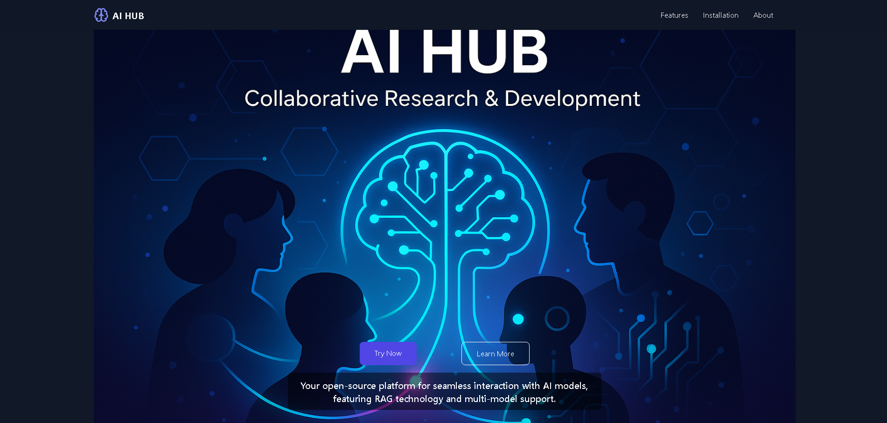

# AI Hub Landing Page

A modern, responsive landing page for the AI Hub project built with React, TypeScript, and Tailwind CSS.

## Description

The AI Hub Landing Page showcases the key features, installation instructions, and information about the AI Hub platform - an open-source solution for interacting with AI models.

## Screenshots



## Installation

Follow these steps to set up the landing page locally:

1. Clone the repository:

```bash
git clone https://github.com/TheWatcher01/ai-hub-landing.git
```

2. Navigate to the project directory:

```bash
cd ai-hub-landing/project
```

3. Install dependencies:

```bash
npm install
```

4. Start the development server:

```bash
npm run dev
```

5. Open your browser and visit `http://localhost:5173` (or the port displayed in your terminal)

## Features

- Responsive design that works on all screen sizes
- Dark/light mode toggle
- Smooth scrolling navigation
- Interactive UI elements
- Optimized for performance

## Building for Production

To create a production build:

```bash
npm run build
```

The build files will be generated in the `dist` directory.

## Technologies Used

- React
- TypeScript
- Tailwind CSS
- Vite
- Lucide React (for icons)

## Contributing

Contributions are welcome! Please feel free to submit a Pull Request.

## License

This project is licensed under the MIT License - see the LICENSE file for details.

## Related Project

This landing page is for the [AI Hub](https://github.com/TheWatcher01/ai-hub) project, an open-source platform for AI model interaction.
